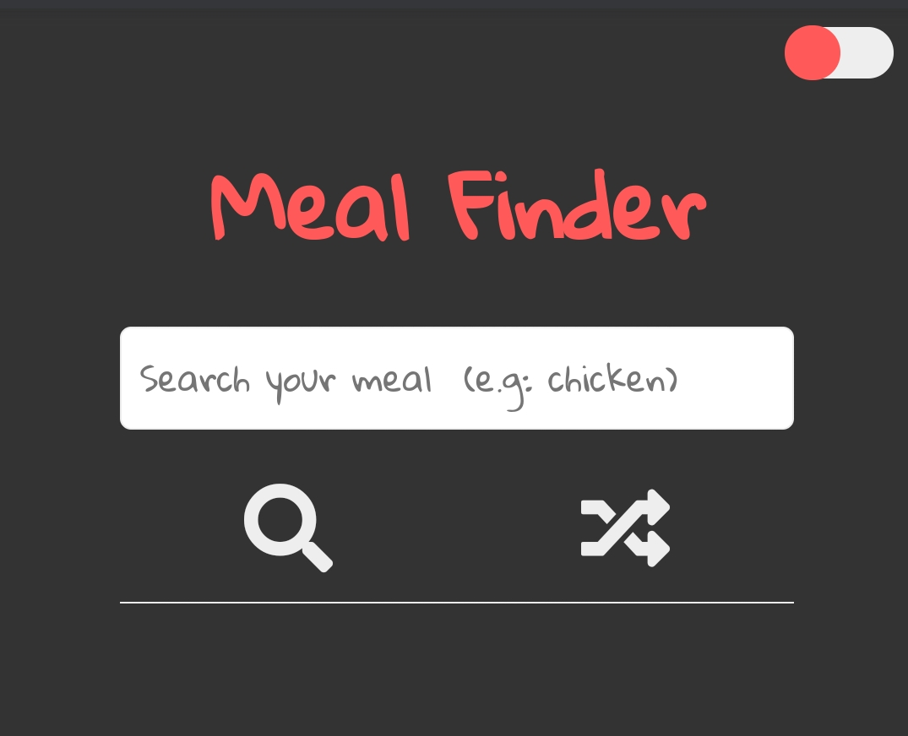
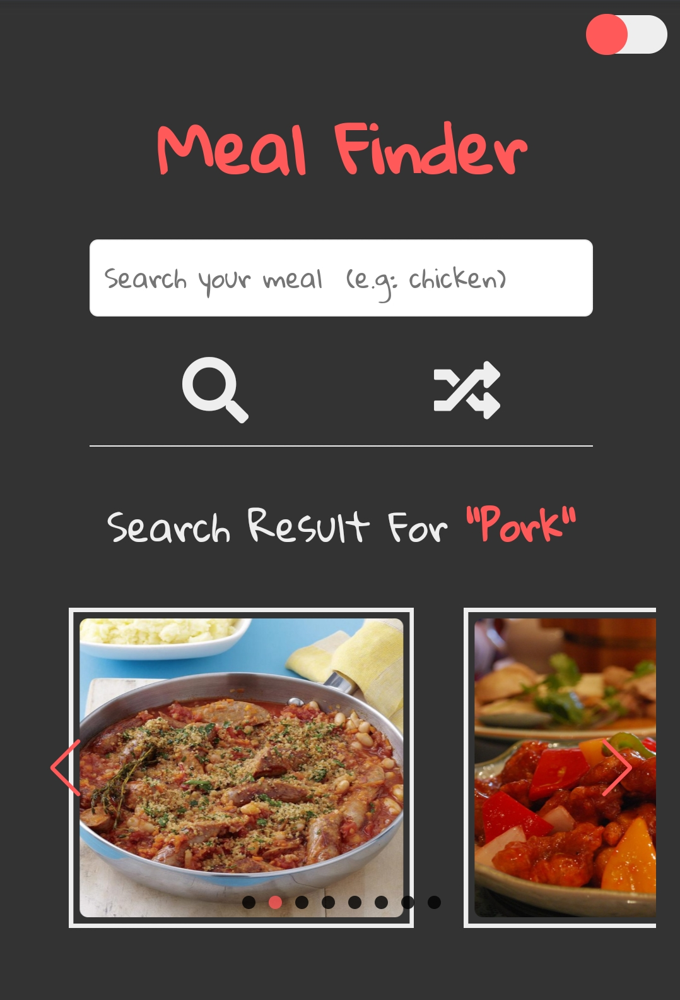

# Meal Finder App

Search and generate random meals from the [themealdb.com](https://www.themealdb.com/) API

## Preview this project here 👉 [MealFinder](https://joker-bat.github.io/mealfinder/)

 

## Project Specifications

- Display UI with form to search and button to generate
- Connect to API and get meals
- Display meals in DOM with image and hover effect
- Click on meal and see the details
- Display list of ingredients with unit
- Click on youtube button to see a video tutorial
- Click on shuffle button and fetch & display a random meal
- If you like to change between light and dark mode toggle the switch on top right
- Simple loading animation with CSS

 

### SMALL UPDATE

- Added Swiper JS for display a list of meals as scrolable content instead of Grid

 
 

### If you have any suggestion make a pull request 😉
